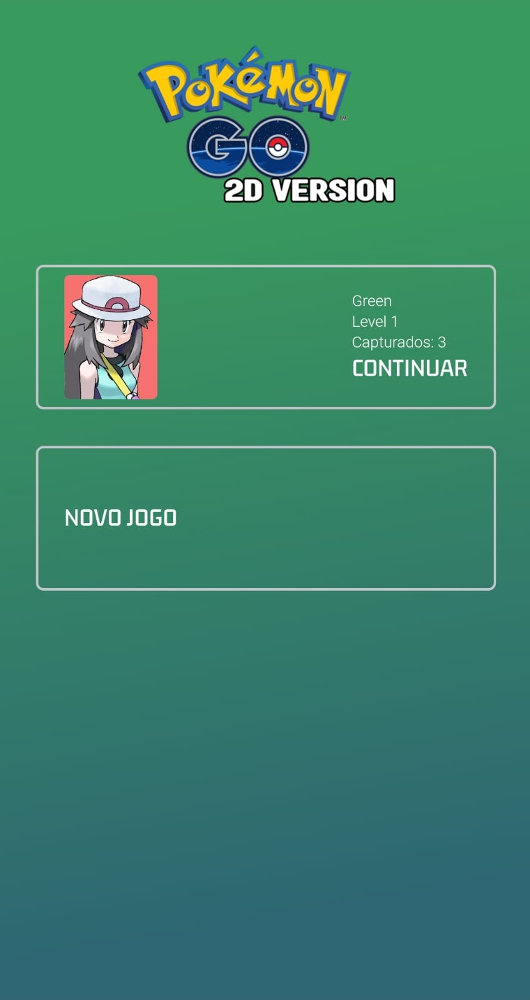
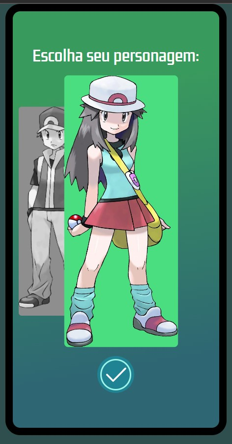
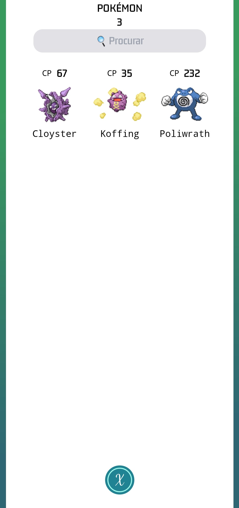
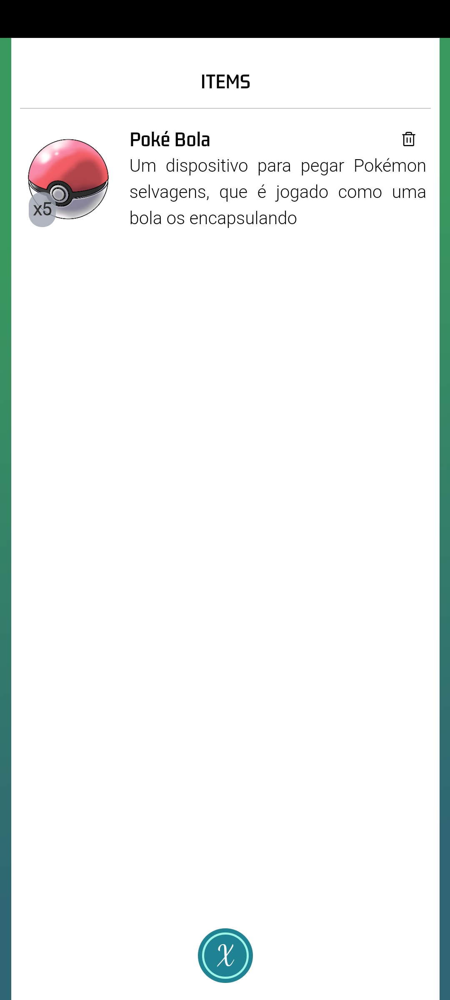

Pokémon GO 2D VERSION é minha reimaginação do clássico sucesso mundial, onde você anda pela cidade, capturando os monstrinhos.
O jogo está sendo desenvolvido com REACT JS, Tailwind CSS , Javacript e Typescript para o front-end.
O back-end será desenvolvido na versão 2.00, onde usará rest api em node express e banco de dados com MONGODB.
O projeto está totalmente responsivo para pc e android e parcialmente para IOS (devido à limitações de uso do navegador SAFARI)

# Pokemon Go 2D Roadmap to 1.00

- [x] loading screen
- [x] pokestops creation
- [x] pokemon creation
- [x] map screen
- [x] menu
- [x] catch screen
- [x] pokemon removal on catch 
- [x] map boundaries
- [x] mobile joystick
- [x] change alerts for screen texts
- [x] CP calculation
- [x] Add pokemon types
- [x] pokemon bag
- [x] character selection
- [x] bag creation
- [x] bag screen
- [x] items bag creation
- [x] items bag screen
- [x] music
- [x] sfx
- [x] permanent save (localstorage)
- [x] continue / new game
- [ ] pokemon details screen
- [ ] level up system

# Pokemon Go 2D Roadmap to 2.00
- [ ] authentication system
- [ ] cloud saving
- [ ] battle system
- [ ] gym battles
- [ ] raid battles
- [ ] pvp battles
